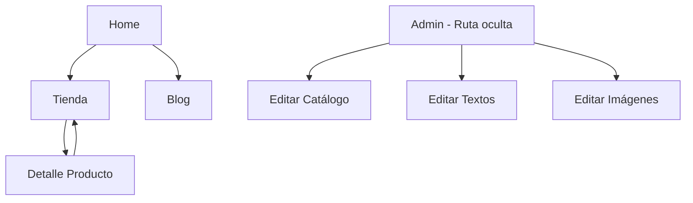

# Diseño del Frontend de la Tienda Virtual de Arquitectura

## Descripción General
El frontend será una aplicación web para promocionar una empresa de arquitectura, combinando elementos de blog y tienda virtual. Utilizaremos Next.js para el framework de React y Bootstrap para el diseño responsivo y profesional.

## Tecnologías
- **Framework**: Next.js (React)
- **Estilos**: Bootstrap 5
- **Estado**: Context API o Zustand para manejo de estado (catálogo, textos dinámicos)
- **Rutas**: Next.js App Router
- **Estilo Profesional**: Tema minimalista con paleta de colores neutros (grises, blancos, acentos en azul o verde para arquitectura)

## Estructura de Páginas
1. **Home (/)**: Página principal con información de la empresa (quiénes somos, misión, visión), hero section, y navegación.
2. **Tienda (/tienda)**: Catálogo de diseños arquitectónicos con filtros y búsqueda.
3. **Detalle de Producto (/tienda/[id])**: Vista detallada de un diseño.
4. **Blog (/blog)**: Artículos promocionales (opcional, si se expande).
5. **Panel Admin (/admin)**: Ruta oculta para gestión del catálogo y contenidos.

## Componentes Principales
- **Navbar**: Navegación principal con enlaces a Home, Tienda, Blog.
- **Footer**: Información de contacto, redes sociales.
- **HeroSection**: Sección destacada en Home con imagen y texto.
- **ProductCard**: Tarjeta para cada diseño en el catálogo.
- **AdminPanel**: Formularios para agregar/editar/eliminar productos y textos.
- **Modal**: Para confirmaciones en admin.

## Diseño UI/UX
- **Paleta de Colores**: Blanco (#FFFFFF), Gris claro (#F8F9FA), Gris oscuro (#6C757D), Azul arquitectura (#007BFF).
- **Tipografía**: Sans-serif moderna (Bootstrap default).
- **Layout**: Responsivo con grid de Bootstrap.
- **Estilo Profesional**: Imágenes de alta calidad de diseños arquitectónicos, espaciado generoso, efectos sutiles (hover en cards).

## Navegación y Flujo

## Funcionalidades Clave
- **Catálogo Dinámico**: Productos almacenados en estado o API, editables desde admin.
- **Textos Dinámicos**: Misión, visión, etc., editables.
- **Panel Admin Oculto**: Acceso por URL directa o autenticación simple.
- **Responsive**: Funciona en móvil, tablet, desktop.

## Próximos Pasos
Este diseño servirá como base para la implementación en Code mode.